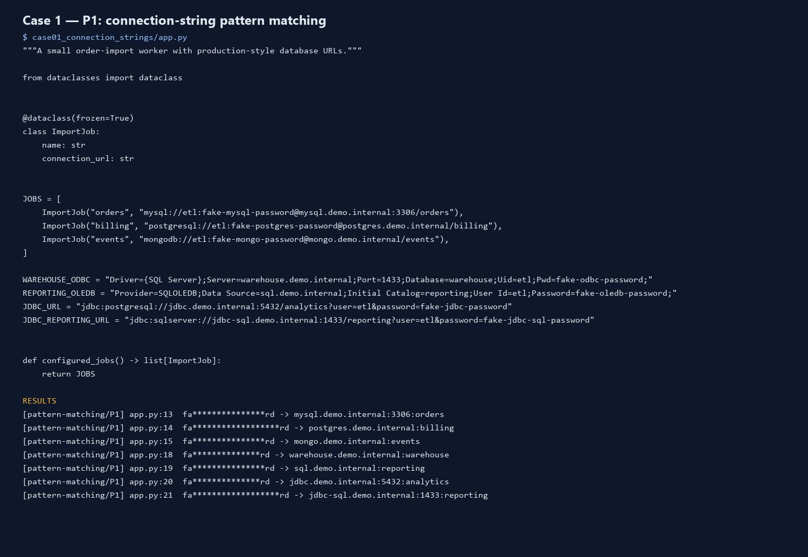
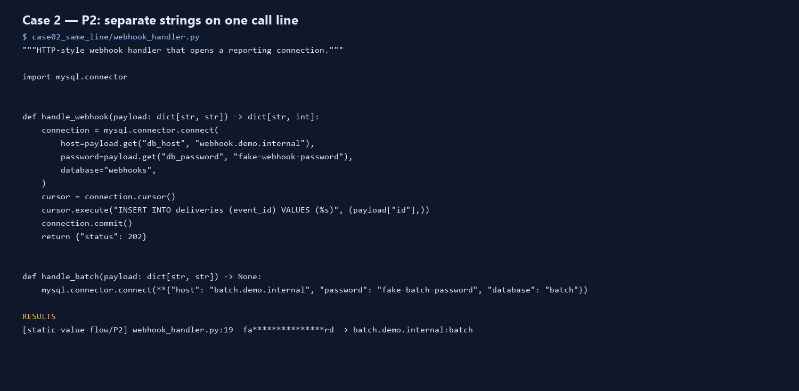
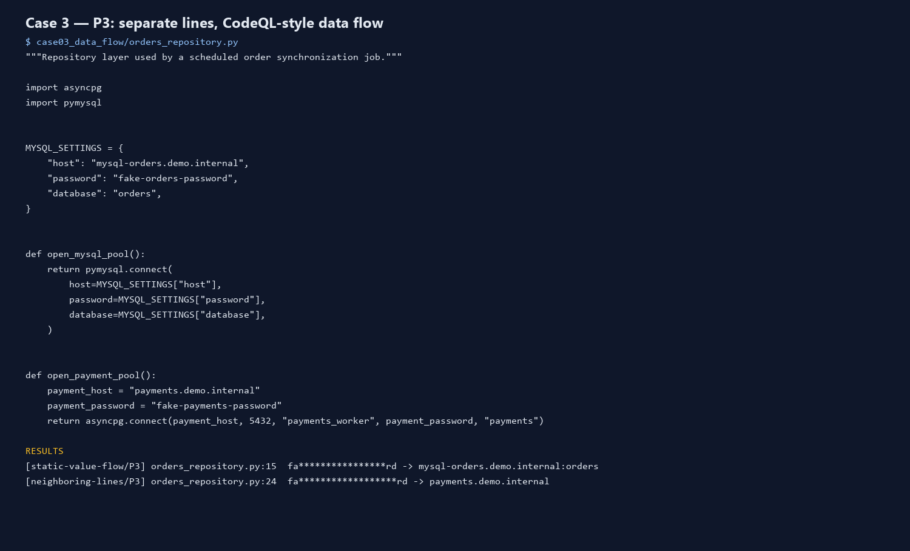
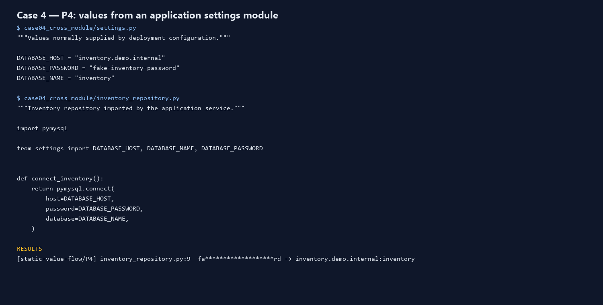
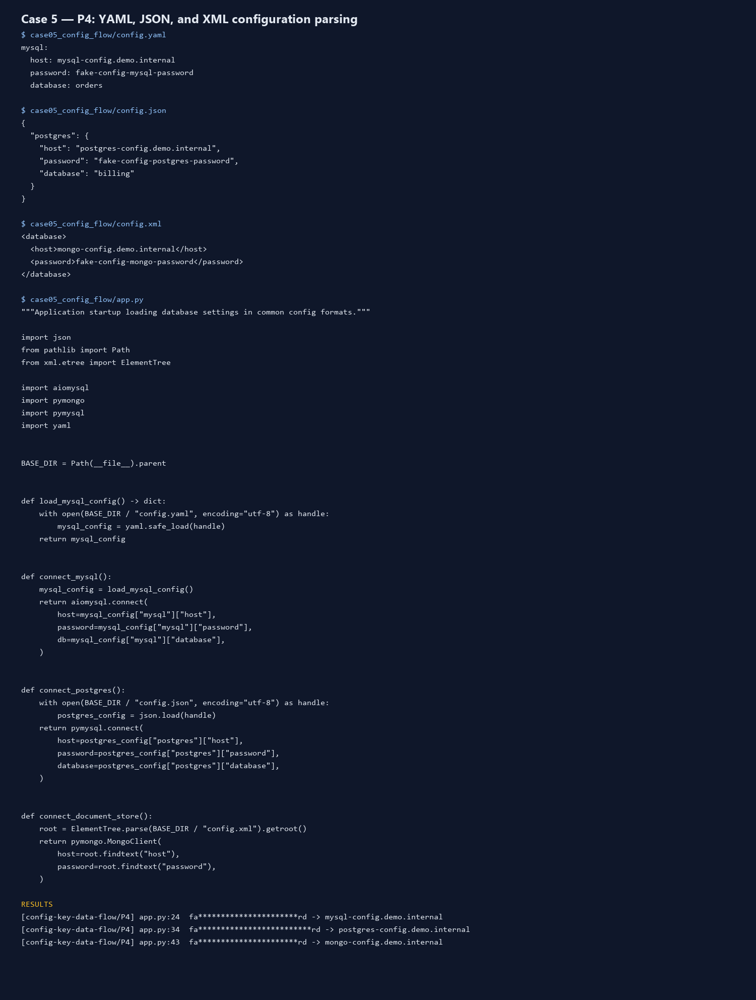
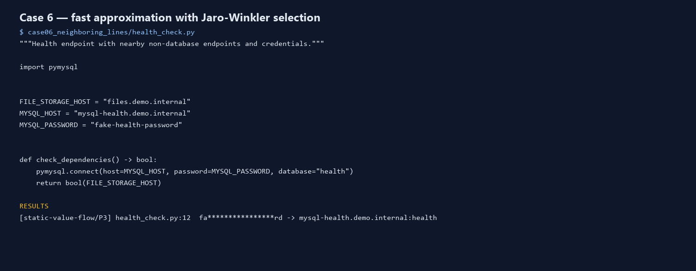
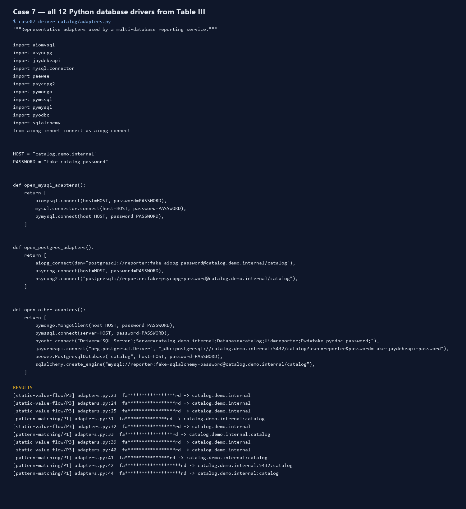
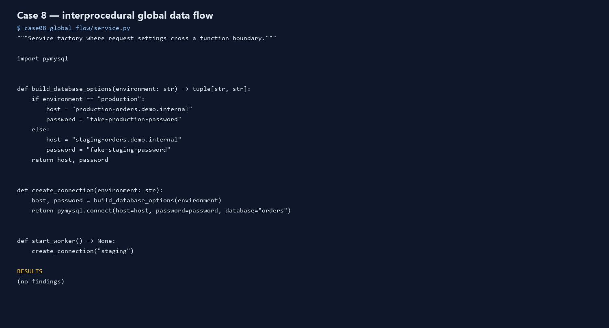
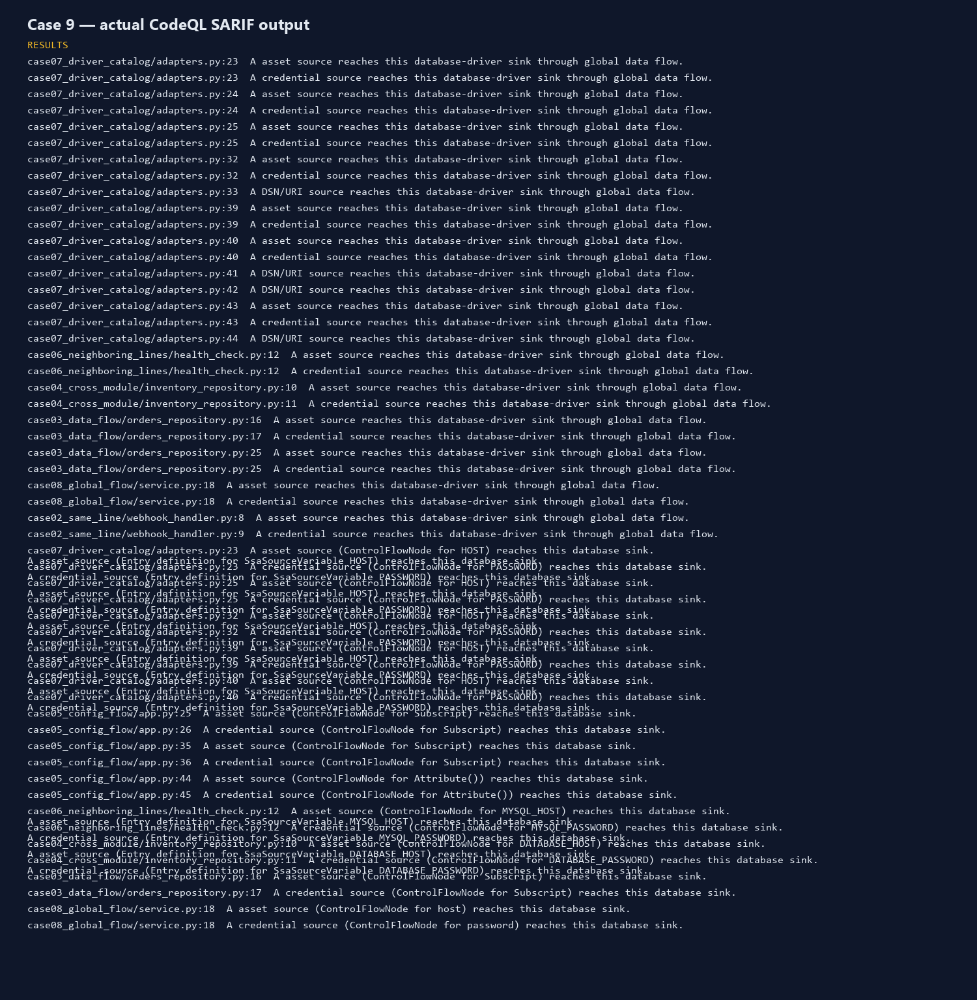

# AssetHarvester 논문 시뮬레이션 보고서

## 목적과 안전성

본 프로젝트는 Basak 외 5인의 ICSE 2025 논문 *AssetHarvester: A Static Analysis Tool for Detecting Secret-Asset Pairs in Software Artifacts*의 탐지 절차를 실습 가능한 형태로 구현한다. 논문은 secret이 보호하는 asset의 맥락을 함께 제시해 오탐을 줄이고 우선순위를 높이는 것을 목표로 한다. 모든 fixture는 `fake-*` 문자열과 문서화용 사설 IP·도메인만 사용한다. 분석 결과에는 원문 secret이 아니라 마스킹된 preview만 기록한다.

이 결과는 AssetBench가 없기 때문에 논문의 Precision 97%, Recall 90%, F1 94%를 재현하거나 주장하는 평가가 아니다. 논문과 같이 실제 자산 접속이나 leaked credential의 유효성 확인도 수행하지 않는다.

## 구현 대응

| 논문 요소 | 논문 관측 | 구현 증빙 |
| --- | ---: | --- |
| P1: 같은 문자열·줄·파일 | 54 / 100 | URI·ODBC/OLE-DB·JDBC 7개 탐지 |
| P2: 분리 문자열·같은 줄·파일 | 20 / 100 | keyword 및 `**dict` DB 호출 2개 탐지 |
| P3: 분리 문자열·다른 줄·같은 파일 | 19 / 100 | keyword와 positional call을 정적 값 전파로 2개 탐지 |
| P4: 분리 문자열·다른 줄·다른 파일 | 7 / 100 | Python import 1개 및 YAML·JSON·XML 3개 탐지 |
| Step 3: 이웃 라인 | ±3줄, threshold 0.5 | 일반 코드 1개·주석 코드 1개를 Jaro–Winkler로 선택 |

연결문자열은 논문의 세 그룹을 구현한다.

1. MySQL·PostgreSQL·MongoDB URI
2. ODBC·OLE-DB 세미콜론 key-value 문자열
3. JDBC의 inline credential 및 query parameter credential

`assetharvester/analyzer.py`의 driver catalog에는 논문 Table III의 12개 Python driver를 선언한다: aiomysql, mysql-connector, PyMySQL, aiopg, asyncpg, psycopg2, pymongo, pymssql, pyodbc, JayDeBeApi, peewee, SQLAlchemy. 연결문자열만 받는 driver는 Step 1에서, 분리된 credential/host 인자는 Step 2에서 처리한다. 각 재현 사례는 `cases/case01_connection_strings/`부터 `cases/case08_global_flow/`까지 실제 애플리케이션 구조를 흉내 낸 독립 폴더로 구성했다.

## CodeQL 구현

실제 CodeQL CLI 2.26.2로 `cases/`의 Python 데이터베이스를 만들고, `codeql/queries/` 아래 두 쿼리를 실행했다. `SecretAssetFlow.ql`은 local-flow 기준선이고, `GlobalSecretAssetFlow.ql`은 `TaintTracking::Global`로 함수 호출 경계를 넘는 source→sink 흐름을 확인한다. 두 쿼리 모두 논문처럼 `semmle.python.ApiGraphs`로 외부 DB driver의 credential/host/DSN sink를 식별한다.

실행 결과는 `outputs/codeql/secret-asset-flow.sarif`에 기록된다. local/global 쿼리는 P2 direct keyword flow, P3 separate-line flow, P4 import flow, Table III driver catalog의 representative flow를 credential·asset·DSN 역할로 기록한다. `case08_global_flow/service.py`의 별도 함수 호출 사례도 global query에서 확인된다. Python AST 보완기는 이 sink 문맥에서 host·port·database와 password를 하나의 pair로 재구성하고, YAML·JSON·XML 값은 설정 파일 key flow로 보완한다.

재실행 명령은 다음과 같다.

```powershell
powershell -ExecutionPolicy Bypass -File scripts\run_codeql.ps1
```

## 케이스별 캡처

### Case 1 — P1 연결문자열



URI 3개, ODBC/OLE-DB 2개, JDBC 2개가 pattern matching으로 탐지된다.

### Case 2 — P2 같은 줄의 분리 인자



동일 호출 줄의 named argument와 dictionary unpacking을 pair로 연결한다.

### Case 3 — P3 다른 줄의 data flow



PyMySQL keyword와 asyncpg positional argument가 sink로 흐르는 경우다.

### Case 4 — P4 Python 모듈 간 값 전달



`from ... import ...`로 다른 파일의 host와 password가 호출 sink에 도달한다.

### Case 5 — P4 설정 파일 파싱



YAML, JSON, XML의 key를 파싱해 secret-asset pair를 구성한다. YAML loader 호출은 CodeQL SARIF에서도 sink 흐름으로 확인된다.

### Case 6 — Step 3 이웃 라인 휴리스틱



동일 창에 file server와 database host가 있어도 variable prefix가 더 유사한 MySQL host를 선택한다. 주석으로 남은 MongoDB 값도 포착한다.

### Case 7 — Table III 드라이버 catalog



12개 드라이버의 keyword/positional/connection-string 입력 형태를 한 fixture에 모아 Step 1 또는 Step 2 경로로 분석한다.

### Case 8 — 전역 data flow



비밀과 host가 별도 함수의 인자로 전달된 뒤 `pymysql.connect`에 도달하는 사례다. `GlobalSecretAssetFlow.ql`이 함수 경계를 넘어 두 역할을 모두 보고한다.

### Case 9 — 실제 CodeQL SARIF



## 검증 결과

```text
python -m unittest discover -s tests -v
Ran 8 tests ... OK

CodeQL SARIF result count: 54
```

테스트는 P1의 세 regex 그룹, P2/P3/P4 고신뢰 흐름, 세 config format, Jaro–Winkler 후보 선택, fixture secret 마스킹을 검증한다.

## 한계와 확장

- AssetBench는 민감정보 보호를 위해 제한 배포되므로 본 프로젝트에 포함하지 않았다.
- 실제 CodeQL 쿼리는 fixture에서 다루는 DB driver sink의 representative keyword flow를 실행한다. 모든 driver의 모든 version-specific positional signature는 vendor 문서에 맞춰 추가 모델링이 필요하다.
- AST 보완기는 상수·f-string·dictionary·단순 import에 집중한다. reflection, runtime environment 변수, 동적 import는 논문의 Step 3와 마찬가지로 정밀한 data flow만으로 완전하게 해결되지 않는다.
- `--history`는 Git repository에서 Step 1의 pattern matching을 모든 reachable commit의 파일 snapshot에도 적용하고 commit id를 evidence에 남긴다.
